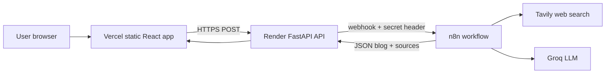
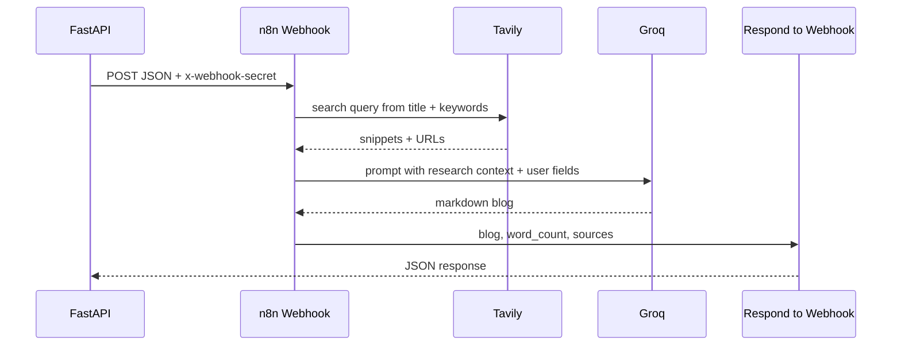

# Blog Generator — Full System Plan

## Your approach: backend first, then frontend

**Yes — build backend first.** Reasons:

1. The contract (`POST /api/v1/blog/generate` + n8n webhook payload/response) is the spine of the system.
2. You can validate the full pipeline (form → API → n8n → markdown) with Swagger at `/docs` before any UI work.
3. Frontend becomes a thin, typed client once the API is stable.

---

## Architecture (one link for the interviewer)



| Layer | Host | Why not all on Vercel? |
|-------|------|-------------------------|
| Frontend | **Vercel** (free) | Perfect for Vite/React static build |
| Backend | **Render** (free) | Python/FastAPI long-running + 120s timeouts |
| Workflow | **n8n** | Orchestrates search + LLM without bloating your API |

**Single shareable URL:** `https://your-app.vercel.app` (set `VITE_API_BASE_URL` to your Render API). Interviewers only need that link.

**n8n recommendation (you were undecided):** Start with **[n8n Cloud](https://n8n.io)** free trial for the interview demo — no Docker/Railway ops, webhook URL in minutes. Export the workflow JSON into the repo under `n8n/` so you can migrate to Railway later if needed. Railway self-host is documented in [docs/BACKEND.md](docs/BACKEND.md) as plan B.

---

## Monorepo layout (clean for interview)

Keep everything in [Blog-Generation](e:\Blog Generator\Blog-Generation) instead of two separate repos:

```
Blog-Generation/
├── backend/                    # FastAPI (from docs: blog-generator-api/)
│   ├── app/
│   │   ├── main.py
│   │   ├── config.py
│   │   ├── dependencies.py
│   │   ├── api/v1/routes/{blog,health}.py
│   │   ├── services/n8n_service.py
│   │   ├── models/{request,response}.py
│   │   └── core/{exceptions,logging}.py
│   ├── requirements.txt
│   ├── render.yaml
│   ├── .env.example
│   └── README.md
├── frontend/                   # Vite + React + TS (from docs)
│   ├── src/...
│   ├── vercel.json
│   ├── .env.example
│   └── README.md
├── n8n/
│   └── blog-generate-workflow.json   # exported workflow for reproducibility
├── docs/
│   ├── BACKEND.md
│   └── FRONTEND.md
└── README.md                   # root: setup, env vars, deploy steps, demo link
```

---

## User inputs (production-minded, interview-appropriate)

Extend the docs’ model with **primary vs secondary keywords** (your choice):

| Field | Type | Rules | Purpose |
|-------|------|-------|---------|
| `title` | string | 5–150 chars | Blog topic / H1 direction |
| `primary_keywords` | string[] | 1–5, required | Main SEO terms (weighted in search + prompt) |
| `secondary_keywords` | string[] | 0–10, optional | Supporting terms |
| `target_audience` | string | 3–100 chars | Voice and depth |
| `tone` | enum | professional, conversational, academic, humorous, persuasive | Style |
| `length` | enum | short (~500), medium (~1000), long (~2000) | Word target |
| `language` | enum | english, hindi, spanish, french, german | Output language |
| `additional_context` | string? | max 500 | Extra instructions |

**Backend:** Pydantic validators strip/lowercase keywords; reject empty primary list.

**n8n search query:** Build from `title` + `primary_keywords` (+ top secondary if present), e.g. `"{title}" {" ".join(primary_keywords)} 2025 latest`.

**LLM prompt:** Explicit sections for primary (must appear naturally) vs secondary (use where relevant).

---

## API contract (align FE + BE — fix doc drift)

Implement consistently (docs have small mismatches to fix during build):

| Item | Correct value |
|------|----------------|
| Generate path | `POST /api/v1/blog/generate` |
| Request JSON | **snake_case** (`target_audience`, `primary_keywords`, …) |
| Response JSON | **snake_case** (`word_count`, `generated_at`, `sources`) |
| Frontend | Map camelCase form state → snake_case in Axios before POST |

**Response shape** (unchanged from [docs/BACKEND.md](docs/BACKEND.md)):

```json
{
  "blog": "## Title\n\n...(markdown)...",
  "word_count": 1024,
  "sources": ["https://..."],
  "generated_at": "2026-05-29T12:00:00Z"
}
```

**Errors:** 422 validation, 429 rate limit, 502 n8n error, 504 timeout (120s backend, 90s frontend Axios).

---

## Phase 1 — Backend (implement per [docs/BACKEND.md](docs/BACKEND.md))

1. Scaffold `backend/` with FastAPI, Uvicorn, Pydantic v2, httpx, slowapi, loguru, pydantic-settings.
2. Update `BlogRequest` in `app/models/request.py` with `primary_keywords` / `secondary_keywords` (remove single `keywords` list).
3. Implement `N8NService` — POST payload includes both keyword lists; header `x-webhook-secret`.
4. Routes: `GET /api/v1/health`, `POST /api/v1/blog/generate` with per-IP rate limit (10/min).
5. CORS: `ALLOWED_ORIGINS` from env (localhost:5173 dev, Vercel URL prod).
6. Shared `httpx.AsyncClient` in app lifespan; custom exceptions → HTTP status mapping.
7. Commit `render.yaml`, `.env.example`, local `README` with `uvicorn app.main:app --reload --port 8000`.

**Local test without frontend:** Swagger at `http://localhost:8000/docs`.

---

## Phase 2 — n8n workflow (the “AI engine”)

n8n is **not** a replacement for your API — it is the **workflow runtime** your API triggers synchronously.



**Nodes (in order):**

1. **Webhook** — POST, path e.g. `generate-blog`, authenticate via `x-webhook-secret` (IF node or header check).
2. **HTTP Request → Tavily** — `POST https://api.tavily.com/search` with API key in env; query from Code node.
3. **Code** — Format Tavily results into a context block; collect `sources` URLs.
4. **HTTP Request → Groq** — Chat completions API; system prompt: use only provided research, cite trends, match tone/length/language, weave primary keywords.
5. **Code** — Parse LLM output, `word_count`, merge `sources`.
6. **Respond to Webhook** — Return JSON exactly as API expects.

**Secrets (only in n8n credentials, never in repo):** `TAVILY_API_KEY`, `GROQ_API_KEY`, webhook secret (same as `N8N_WEBHOOK_SECRET` on Render).

Export workflow → `n8n/blog-generate-workflow.json` and document import steps in root README.

---

## Phase 3 — Frontend (implement per [docs/FRONTEND.md](docs/FRONTEND.md))

1. Scaffold `frontend/` with Vite React TS, Tailwind, ShadCN, React Hook Form, Zod, TanStack Query, Axios, react-markdown, react-hot-toast.
2. **Keywords UI:** two tag inputs — `PrimaryKeywordsInput` + `SecondaryKeywordsInput` (reuse tag pattern from docs’ `KeywordsInput`).
3. Zod schema mirrors backend limits; `blogApi.ts` posts to `/api/v1/blog/generate` with snake_case body.
4. **Fix doc typo:** use `/api/v1/blog/generate`, not `/api/v1/generate`.
5. Map API response snake_case → camelCase in one place for components (`wordCount`, `generatedAt`).
6. UX: loading overlay with progressive messages, markdown preview, sources list, copy/download `.md`, error toasts.
7. `vercel.json` SPA rewrite; `VITE_API_BASE_URL` in Vercel env.

---

## Phase 4 — Production polish (interview differentiators)

- **Root README:** architecture diagram, env table, “how to run locally”, deployed demo URL.
- **Health check:** frontend optional banner if `GET /api/v1/health` fails (API down).
- **Security:** webhook secret; no API keys in frontend; `.env` gitignored; `.env.example` committed.
- **Rate limiting:** slowapi on generate endpoint (protects free tier).
- **Logging:** loguru on backend; request id optional if time permits.
- **Optional nice-to-have:** export workflow + seed example in README for reproducible demo.

---

## Deployment checklist (free tier)

| Service | What to deploy | Env vars |
|---------|----------------|----------|
| **n8n Cloud** | Import workflow, activate | Tavily + Groq credentials in n8n |
| **Render** | `backend/` via `render.yaml` | `N8N_WEBHOOK_URL`, `N8N_WEBHOOK_SECRET`, `ALLOWED_ORIGINS=https://xxx.vercel.app` |
| **Vercel** | `frontend/` root directory | `VITE_API_BASE_URL=https://xxx.onrender.com` |

**Order:** n8n workflow live → backend on Render with webhook URL → frontend on Vercel with API URL → smoke test from production URL.

**Render free tier note:** service may spin down on idle; first request can be slow — acceptable for interview; mention in README.

---

## Implementation order (todos)

Backend and n8n can overlap: define webhook contract in code first, then build n8n to match.

1. Scaffold `backend/` + models with primary/secondary keywords + health route  
2. Implement `N8NService` + blog route + rate limit + CORS + logging  
3. Build/import n8n workflow (Tavily + Groq) and test end-to-end via Swagger  
4. Deploy backend to Render; set env vars  
5. Scaffold `frontend/` + form (dual keyword inputs) + API client + result UI  
6. Wire camelCase ↔ snake_case; fix API path  
7. Deploy frontend to Vercel; set `VITE_API_BASE_URL` and backend `ALLOWED_ORIGINS`  
8. Root README + export `n8n/blog-generate-workflow.json` + final production smoke test  

---

## External accounts you will need

- [Tavily](https://tavily.com) — web search API key  
- [Groq](https://groq.com) — free LLM API key  
- [n8n Cloud](https://n8n.io) (recommended) or Railway for self-host  
- [Render](https://render.com) — backend  
- [Vercel](https://vercel.com) — frontend  

No code changes required in this planning step; execution starts with `backend/` scaffold once you approve.
